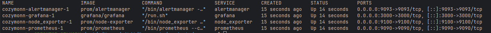
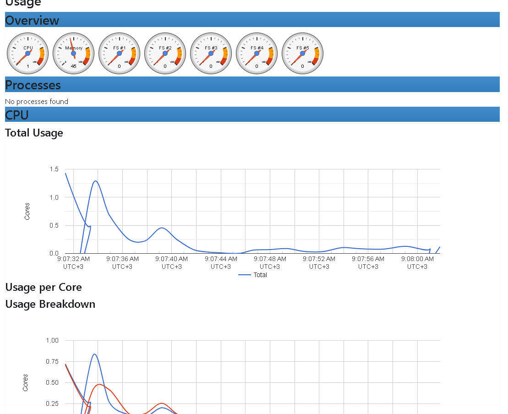

1) Using docker compose:

Run:
```docker compose up -d```

Check status:
```docker compose ps -a```


Access UI:
Prometheus: http://localhost:9090/targets

Grafana: http://localhost:3000 (admin/admin123)

Node Exporter: http://localhost:9100/metrics

Cadvisor UI: http://localhost:8080/



2) using vagrant:
```vagrant up```
