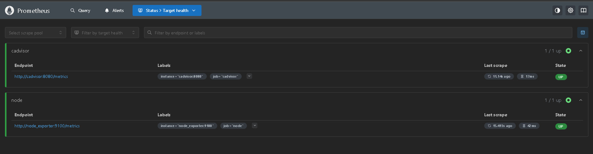

Convenient solution for monitoring resources on localhost

1) Using docker compose:
Run:
```docker compose up -d```

Check status:
```docker compose ps -a```


Access UI:
Prometheus: http://localhost:9090/targets


Grafana: http://localhost:3000 (admin/admin123)


Cadvisor UI: http://localhost:8080/


Node Exporter: http://localhost:9100/metrics


2) using vagrant:
```vagrant up```

Install Windows Exporter (allow connections for 9182 port):
1) ```msiexec /i windows_exporter-0.24.0-amd64.msi ENABLED_COLLECTORS="cpu,memory,net" LISTEN_PORT=9182```
2) edit `windows_targets.yml`

Or install using ansible:
```ansible-playbook -i windows_hosts.ini ansible/windows/install_windows_exporter.yml```

Install on certain host:
```ansible-playbook -i windows_hosts.ini ansible/windows/install_windows_exporter.yml --limit win-server1```

Redefine cli vars:
```ansible-playbook -i windows_hosts.ini ansible/windows/install_windows_exporter.yml -e "exporter_port=9192"```

To set up WinRM run ansible/windows/help/winrm.ps1
